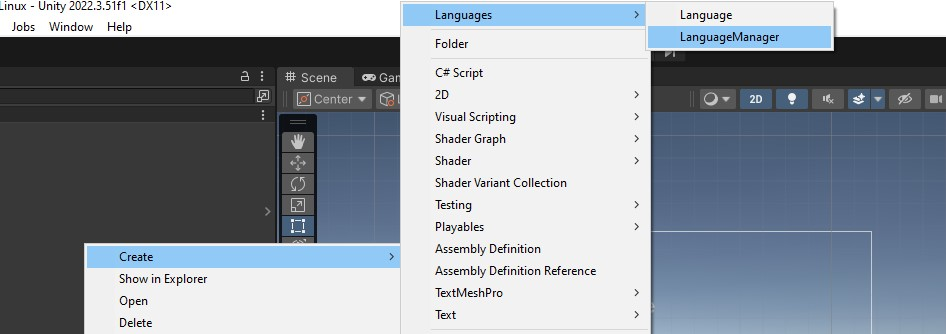
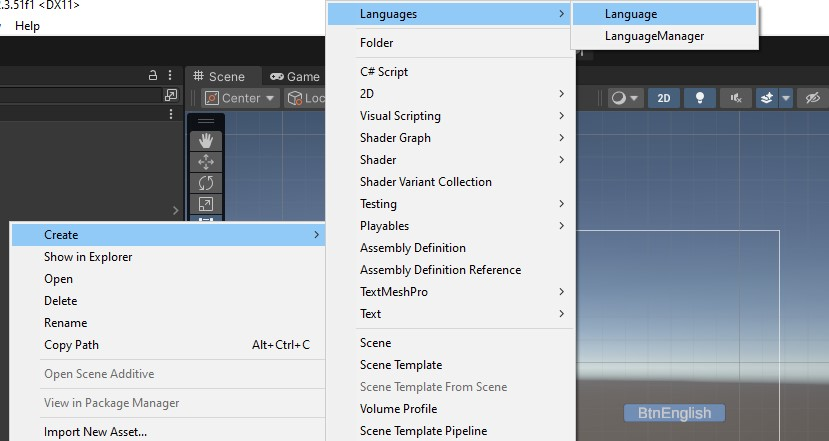
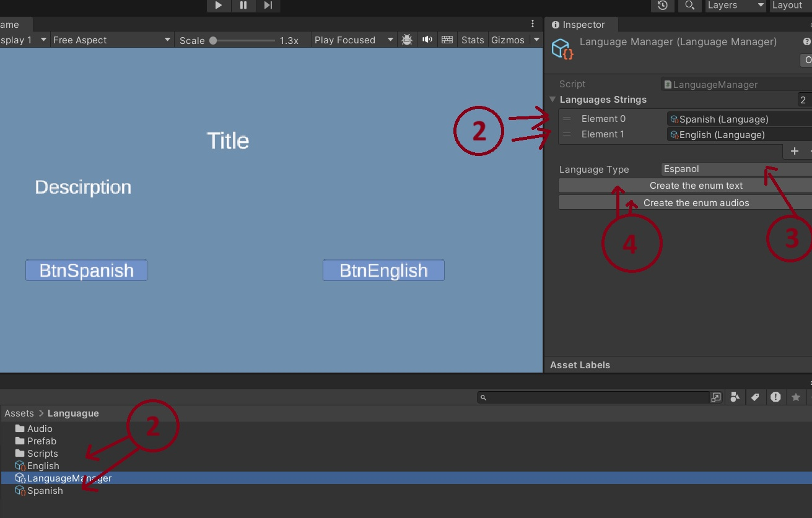
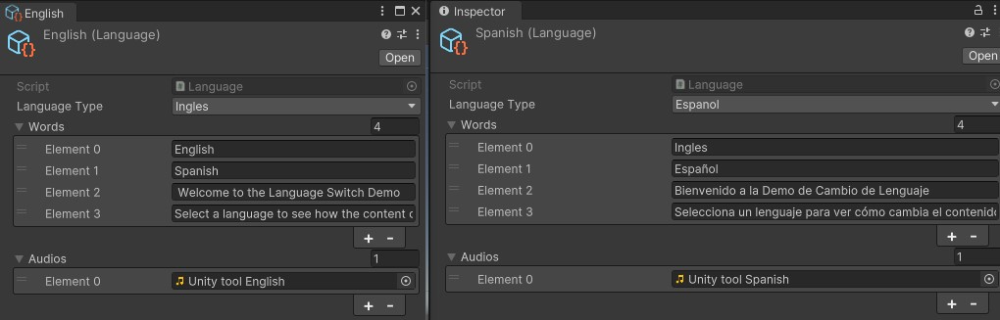
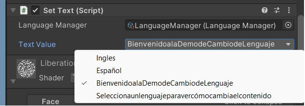

# Unity Custom Tools - Herramienta de Lenguaje para Unity


_Una captura de pantalla o un GIF corto de tu escena demo en acción._

Una herramienta de localización simple pero potente para Unity, diseñada para gestionar y cambiar fácilmente entre múltiples idiomas tanto para activos de texto como de audio dentro de tus proyectos de Unity.

---

## ✨ Características

* **Gestión Basada en ScriptableObject:** Datos de idioma centralizados usando **ScriptableObjects** para una fácil organización y edición.
* **Localización de Texto:** Localiza sin problemas todos los elementos de texto de la UI.
* **Localización de Audio:** Gestiona y reproduce clips de audio específicos para cada idioma.
* **Traducciones Indexadas:** Asegura que las traducciones de texto y audio para cada idioma se alineen perfectamente usando índices de array.
* **Fácil Integración:** Diseñado para una configuración rápida y cambios de código mínimos en proyectos existentes.

---

## 🚀 Empezando

### Instalación

Clona o descarga este repositorio en la carpeta `Assets` de tu proyecto Unity.
    ```bash
    git clone https://github.com/Caalpar/Unity-Custom-Tools.git 
    ```


### Cómo Usar

### 1. Crea tus Activos de Idioma

#### Create LanguagueManager:
  
#### Create Languague:
  
  
  (Crea uno para cada idioma que quieras soportar, por ejemplo, "English", "Spanish", "French").

#### 2. Configura tu Language Manager

1.  Selecciona tu ScriptableObject `LanguageManager` en la ventana del Proyecto.
2.  Arrastra y suelta tus ScriptableObjects `Language` en el array "Languages".
3.  Establece el `Default Language` al idioma que quieras cargar inicialmente.

     

#### 3. Añade Traducciones a Cada Idioma

1.  Selecciona un ScriptableObject `Language` (por ejemplo, "Spanish").
2.  En el Inspector, expande los arrays "Words" y "Audios".
3.  **Fundamentalmente, asegúrate de que el índice para un texto/audio específico coincida en todos los idiomas.**
    * Ej: `Text Translations[0]` = "Hola Mundo" (Español)
    * `Text Translations[0]` = "Hello World" (Inglés)
    * `Audio Translations[0]` = `audio_hola_espanol.mp3`
    * `Audio Translations[0]` = `audio_hello_english.mp3`
  
    

#### 4. Usando en Tu Escena

* **Para Texto:**
    1.  Añade un componente `SetText` a tu GameObject `TextMeshProUGUI` o `UI.Text`.
    2.  Asigna el índice de texto deseado de tus ScriptableObjects `Language`.
    3.  Asigna el  `LanguageManager` que quieres usar.
    4.  Asigna la referencia de tu `TextMeshProUGUI` o `UI.Text`.

    

* **Para Audio:**
    1.  Añade el prefab `PlayAudio` a tu escena.
    2.  Anade el `LanguageManager` que quieres usar.
    3.  Llama a la funcion Play e indicale en que indece esta el audio que quieres.
        ```csharp
        // Codigo de PlayAudio
        public class PlayAudio : MonoBehaviour
        {
            [SerializeField] LanguageManager languageManager;
            AudioSource audioSource;

            // Start is called before the first frame update
            void Start()
            {
                if (audioSource == null)
                {
                    audioSource = gameObject.AddComponent<AudioSource>();
                    audioSource.loop = false;
                    audioSource.playOnAwake = false;
                }
            }


            public void Play(int index)
            {
                if(audioSource.isPlaying)
                    audioSource.Pause();
                    AudioClip clip = languageManager.GetAudio(index);
                if (clip != null)
                {
                    audioSource.clip = clip;
                    audioSource.Play();
                }
        
            }
        }
        ```

#### 5. Cambiando Idiomas en Tiempo de Ejecución

Puedes cambiar el idioma actual llamando a un método en tu `LanguageManager`.

```csharp
// Ejemplo: Desde un clic de botón de UI o lógica del juego
public void ChangeLanguageToEnglish()
{
    LanguageManager.Instance.SetLanguage("English"); // O por índice si se prefiere
}

public void ChangeLanguageToSpanish()
{
    LanguageManager.Instance.SetLanguage("Spanish");
}
