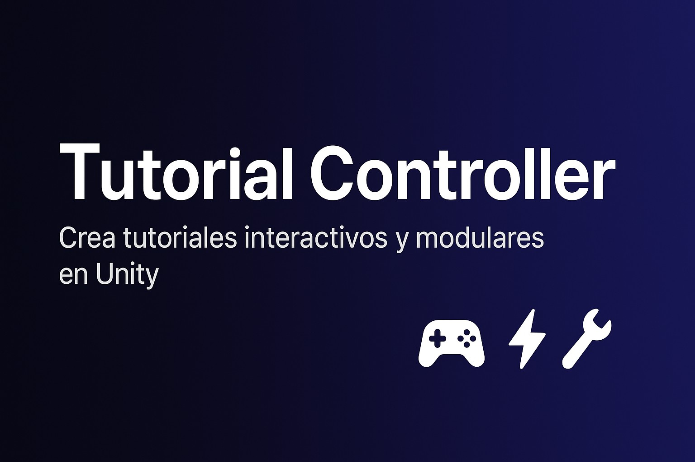
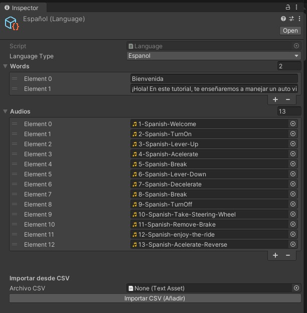
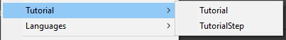
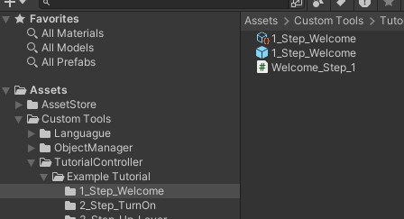

# 🎮 Tutorial Controller para Unity

**Tutorial Controller** es una herramienta robusta y modular para **Unity** que te permite crear **tutoriales interactivos y personalizados** de forma sencilla.  
Es ideal para **guiar a los jugadores** a través de nuevas mecánicas, interfaces de usuario o flujos de juego, asegurando que cada paso sea **claro** y **fácil de seguir**.

---

## ✨ Características Principales

- 🧩 **Flujo guiado:** Define el orden de cada paso del tutorial.  
- 🎭 **Activación automática de objetos:** Activa y desactiva **Actors** según el paso.  
- 🖱️ **Detección de acciones:** Configura pasos que esperan clics, movimientos o interacciones.  
- ⏱️ **Pasos por tiempo:** Define pasos que avanzan automáticamente después de un tiempo.  
- 🔊 **Gestión de audio:** Asigna archivos de audio con repetición opcional para dar pistas.  
- 🔗 **Modularidad:** Integración con **Object Manager** y **Language Manager**.  
- ⚡ **Creación simplificada:** Genera nuevos tutoriales y pasos mediante **ScriptableObjects** con un clic.

---

## 🛠️ Requisitos e Instalación

### **Requisitos**
- Unity **2022.3** o superior.
- Herramientas:  
  - **Object Manager** https://github.com/Caalpar/Unity-Custom-Tools/tree/
  - **Language Manager** https://github.com/Caalpar/Unity-Custom-Tools/tree/LanguagueObjectsManager 

 **Objet Manager:**

  

 **Languague Manager:**


 **Languague:**



### **Instalación**
1. Clona este repositorio o descarga el `.zip`.
2. Importa el paquete en tu proyecto de Unity.
3. Asegúrate de que las dependencias (**Object Manager** y **Language Manager**) ya estén importadas.

> 💡 **Sugerencia:** Aquí podrías poner un **GIF** o **imagen** mostrando el proceso de instalación paso a paso.

---

## 🚀 Cómo Empezar

### **1. Creación de un nuevo tutorial**
- Haz **clic derecho** en tu carpeta de proyecto y selecciona:  
  `Create > Tutorial > Tutorial`.
- Se generará un **ScriptableObject** llamado `TutorialController`.

  

### **2. Configuración de los pasos**
En el **Inspector** del `TutorialController`:
- Presiona **"Add Step"**.

  

- Se creará una nueva carpeta con:
  - `Step` → **ScriptableObject** del paso.
  - `StepPrefab` → Prefab asociado.
  - `StepScript` → Script con la lógica.

  

Para cada paso puedes configurar:
- **Repetir audio del paso:** Repite el aduio cada x segundos.  
- **Tipo de paso:** Acción (espera al usuario) o Tiempo (automático).  
- **Audio:** Asigna un clip desde **Language Manager**.  
- **Actores:** Selecciona los objetos de **Object Manager**.
  - (opcional) puedes definir posiscion y rotacion de los actores
  y puedes usarlo en el metodo 
  ```csharp
  public override void StartStep(Actor[] actorsInStep, Actor[] actorsInTutorial,StepState stepState)
  ```
   **Configuracion del paso:**
   
  
### **3. Implementación de la lógica del paso**
- Abre el script `StepScript`.
- Este hereda de `ActionStep`.
- Implementa la lógica dentro de `StartStep()` usando los métodos disponibles.

  ```csharp
      using System.Collections;
      using System.Collections.Generic;
      using UnityEngine;

      public class Welcome_Step_1 : ActionStep
      {
          // Start is called before the first frame update
          void Start()
          {
              
          }

          // Update is called once per frame
          void Update()
          {
              
          }

          public override void StartStep(Actor[] actorsInStep, Actor[] actorsInTutorial,StepState stepState)
          {
              base.StartStep(actorsInStep, actorsInTutorial, stepState);
          }
      }
        ```

---

## 🤖 Tutorial Controller

El **Tutorial controller** necesita la refernecia del `Objet Manager` y el **Tutorial** la referencia del **Languague Manager**

  


  

### Métodos de Tutorial Controller

| Método                            | Descripción                                      |
| --------------------------------- | ----------------------------------------------- | 
| `Play()`                      | Inicia el tutorial.                       |
| `NextStep()`                      | Avanza al siguiente paso.                       |
| `RepeatAudio(float seconds)`                      | Repite el audio del paso actual cada x segundos.                       |
| `SelectStep()`                      | Selecciona el paso que quieres ejecutar.                       |
| `RestartStep()`  | Reincia el paso actual.                         |  
| `PauseTutorial()`  | Pausa el tutorial.                         |  
| `TryNextStep()`  |Chquea si puede avanzar y avanza al paso siguiente.                         | 
| `NextStepWithDelay(int seconds)`  | Avanza tras X segundos.                         |  
| `ResumeTutorial(int setStep = 0)` | retomar el tutorial en un paso x.              | 

---

## 🤖 Métodos de `ActionStep`

puedes llamar a todos los pasos del tutorial controller desde un step, pero admas tienes estos metodos en cada step

| Método                            | Descripción                                      |
| --------------------------------- | ----------------------------------------------- | 
| `Active(Enum value)`             | Activa un actor por su **Enum**.                | 
| `Active(int index)`             | Activa un actor por su **Indice**.                | 
| `Desactive(Enum value)`         | Desactiva un actor por su **Enum**.             | 
| `Desactive(int index)`         | Desactiva un actor por su **Indice**.             | 
| `GetComponentFrom<T>(Enum value)` | Obtiene un componente de un actor.              | 
| `this[Enum valor]`               | Accede directamente al **GameObject**.          | 


---

## 📦 Repositorio

En el repositorio encontraras una escna ejemplo del protecto **Car Controller With VR**  aplicando el **Tutorial Controller**.

Ya estan todas las dependencias inculuidas y un prefab de TutorialController 

---

## 🤝 Contribuciones

¡Las contribuciones son bienvenidas!  
Si encuentras un **bug** o tienes ideas para **mejorar la herramienta**:
1. Abre un **issue**.
2. Envía un **pull request**.

---

## 📄 Licencia
Este proyecto está bajo la licencia **MIT**.  
Consulta el archivo [LICENSE](LICENSE) para más detalles.

---

## 👨‍💻 Autor
**Carlos Palombo**  
[](https://github.com/TorreSimulacion)
