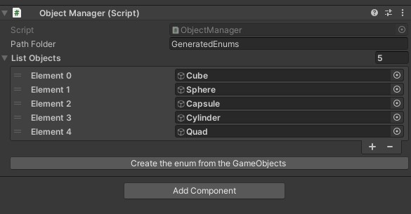

# Object Manager - Herramienta de Gestión de GameObjects para Unity
  

**Object Manager** es una herramienta ligera y eficiente para Unity, diseñada para simplificar la activación y desactivación de GameObjects a través de un sistema de gestión centralizado.  
Su característica principal es la capacidad de generar **Enums personalizados** a partir de tu lista de GameObjects, permitiéndote controlar los objetos de tu escena de forma segura y legible, sin depender de índices mágicos o cadenas de texto.

---

## ✨ Características Principales

- **Gestión Centralizada:** Un único script para controlar múltiples GameObjects.
- **Generación de Enums:** Crea Enums automáticamente a partir de tu lista de GameObjects para un código limpio y sin errores.
- **Control Sencillo:** Métodos intuitivos para activar, desactivar y alternar GameObjects usando tanto índices como los Enums generados.
- **Acceso Directo:** Accede a los GameObjects del array usando el indexador `this[]`.
- **Fácil Integración:** Utiliza el Prefab incluido o añade el script a un GameObject de tu escena.

---

## 🚀 Empezando

### Instalación

1. Clona o descarga el repositorio en tu proyecto de Unity.
2. Los scripts necesarios y un prefab ya están incluidos en el proyecto.

### Cómo Usar

#### 1. Configuración del Object Manager

- Arrastra y suelta el **Prefab `ObjectManager`** desde la carpeta del proyecto a tu escena.
- En el Inspector, arrastra y suelta los **GameObjects** que quieras gestionar en el array `List Objects`.
- Opcionalmente, especifica la **ruta de la carpeta** donde se guardarán los Enums generados en el campo `Path Folder`.

#### 2. Generación de Enums

Una vez que tengas tu lista de objetos configurada, podés generar un Enum para ellos:

- Haz clic derecho en el componente **Object Manager** en el Inspector.
- Selecciona **"Create the enum from the GameObjects"**.

Esto generará un archivo `.cs` con un enum que contiene los nombres de tus GameObjects, listo para ser usado en tus scripts.

> **Nota:** La herramienta toma el nombre de la escena para nombrar el Enum  
> (Ejemplo: si tu escena se llama `Main Menu`, el Enum se llamará `ITEM_MAIN_MENU`).

#### 3. Uso en tus Scripts

Ahora podés usar tu nuevo Enum para controlar los GameObjects de forma segura y legible.

##### Ejemplo de Activación/Desactivación

```csharp
using UnityEngine;
// Asegúrate de incluir el namespace del Enum si es necesario
// (ej: using GeneratedEnums;)

public class MyGameManager : MonoBehaviour
{
    // Asigna tu ObjectManager desde el Inspector
    [SerializeField] private ObjectManager myObjectManager;

    void Start()
    {
        // Activar el panel de configuración usando el Enum
        myObjectManager.Active(ITEM_MAIN_MENU.Panel_Settings);
    }

    public void OpenCredits()
    {
        // Alternar el panel de créditos
        myObjectManager.Toggle(ITEM_MAIN_MENU.Panel_Credits);
    }
}
```

##### Ejemplo de Acceso a un GameObject:

```csharp
// Obtener el GameObject del panel de configuración
GameObject settingsPanel = myObjectManager[ITEM_MAIN_MENU.Panel_Settings];

if (settingsPanel != null)
{
    // Hacer algo con el GameObject
    Debug.Log("Accediendo al objeto: " + settingsPanel.name);
}
```
👨‍💻 **Contribuciones**  
¡Las contribuciones son bienvenidas! Si tienes ideas para mejoras o encuentras un error, por favor, siéntete libre de abrir un issue o enviar un **pull request**.

📜**Licencia**  
Este proyecto está bajo la **Licencia MIT**. Consulta el archivo `LICENSE` para más detalles.